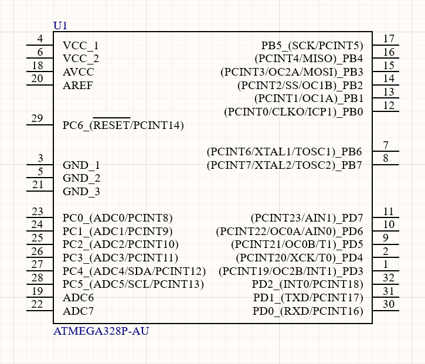
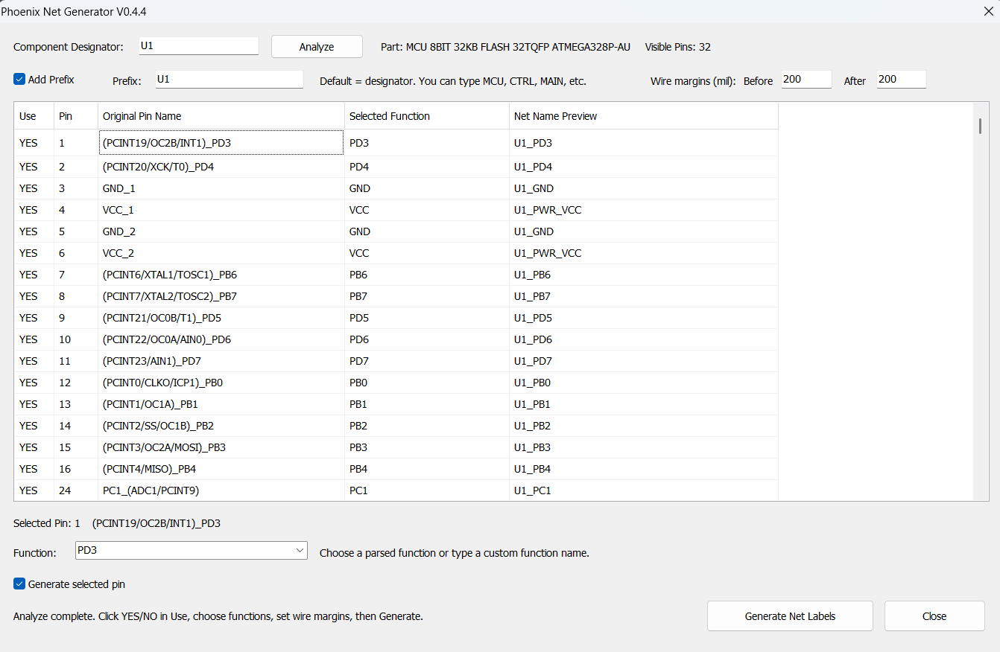
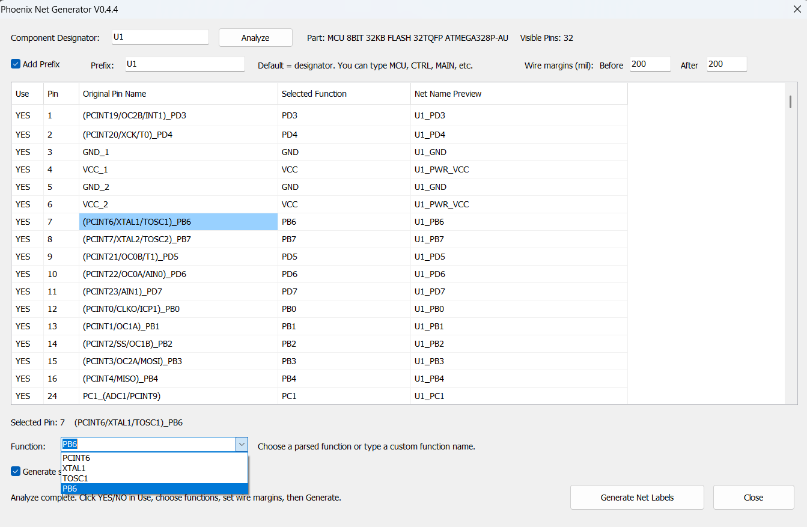
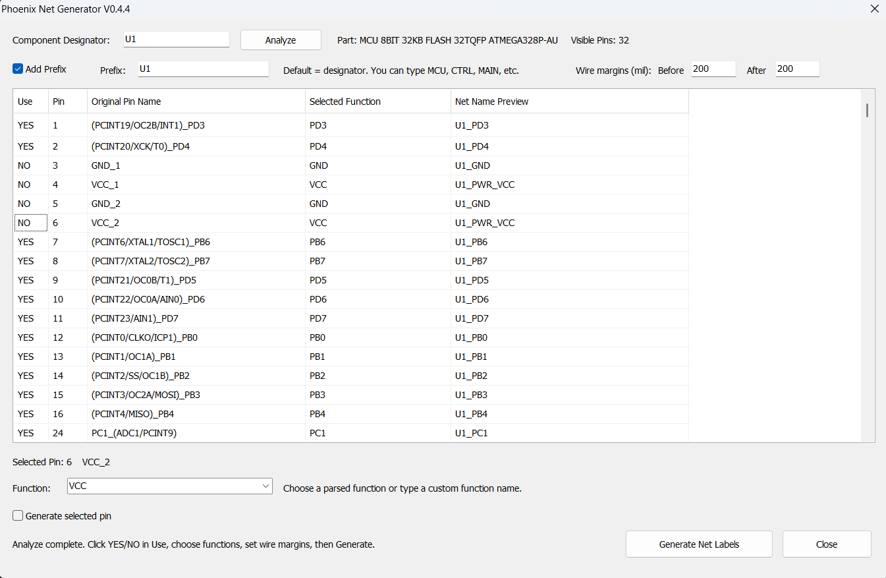
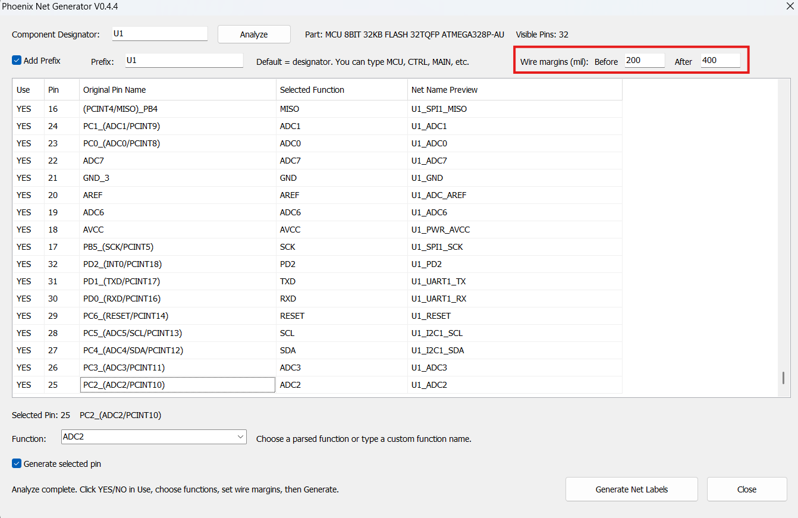
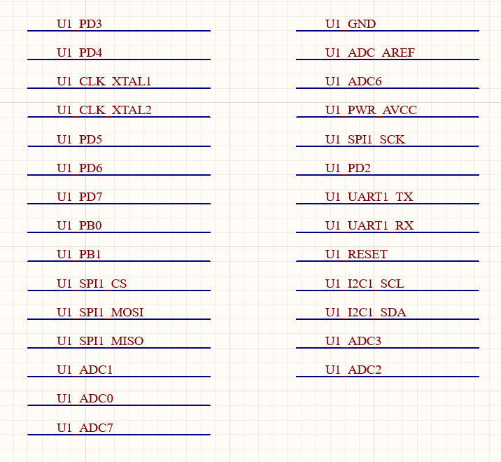

# Phoenix Net Generator

[](https://github.com/AYKUTCOTUR/Phoenix-Net-Generator/releases)
[](https://github.com/AYKUTCOTUR/Phoenix-Net-Generator/blob/main/LICENSE)
[](https://github.com/AYKUTCOTUR/Phoenix-Net-Generator)
[](https://github.com/AYKUTCOTUR/Phoenix-Net-Generator)

**Engineer-in-the-loop semantic net generation for Altium Designer.**

Phoenix Net Generator is an experimental Altium Designer automation tool that reads schematic component pins, parses multifunction pin names, lets the engineer choose the intended function, previews structured semantic net names, and generates an organized bank of schematic Net Labels.

> Phoenix is designed to automate repetitive schematic work without making hidden electrical decisions on behalf of the engineer.

---

## Why Phoenix?

Modern microcontrollers and complex ICs often expose multiple possible functions on a single pin. During schematic development, the engineer must interpret those functions, select the intended use, create meaningful Net Label names, and repeat the same process across many pins.

**Phoenix Net Generator was built to reduce this repetitive work without taking electrical design decisions away from the engineer.** Instead of guessing design intent, Phoenix assists the engineer in turning multifunction pin capabilities into structured, reviewable semantic Net Labels.

The goal is not full autonomous schematic design. It is a more practical form of automation: **let software handle repetitive operations while keeping engineering intent explicit, reviewable, and under human control.**

In an initial ATmega328P-AU workflow benchmark, the Phoenix-assisted process reduced completion time from **149.2 seconds to 58.3 seconds**, representing approximately a **61% reduction in task time** for that specific scenario.

> **Phoenix does not remove the engineering decision. It reduces the repetitive work surrounding that decision.**

See the [Initial Workflow Benchmark](#initial-workflow-benchmark) section for details.

---

## Highlights

- Analyze a schematic component by designator
- Read visible pins directly from the active `.SchDoc`
- Parse multifunction pin names such as `(PCINT6/XTAL1/TOSC1)_PB6`
- Let the engineer select the intended pin function through the UI
- Generate semantic names such as `U1_SPI1_MISO`, `U1_UART1_TX`, or `U1_CLK_XTAL1`
- Use the component designator as the default prefix
- Replace the default prefix with a custom prefix such as `MCU`, `CTRL`, or `MAIN`
- Disable prefixing when no prefix is desired
- Toggle individual pins between **YES** and **NO**
- Exclude disabled pins from Net Label generation
- Enter custom function names when library metadata is insufficient
- Configure wire margins before and after the Net Label
- Generate equal-length label-bank wires based on the widest generated Net Label
- Organize the output bank in 15 rows per column

---

## Current Version

**v0.4.4**

Phoenix is currently a working prototype under active development. It is not yet a fully autonomous schematic or PCB design system.

---

## Workflow

```text
Component Designator
        ↓
Analyze Component
        ↓
Read Visible Pins
        ↓
Parse Multifunction Pin Names
        ↓
Engineer Selects Intended Function
        ↓
Generate Semantic Net Name
        ↓
Preview
        ↓
Enable / Disable Individual Pins
        ↓
Configure Wire Margins
        ↓
Generate Net Label Bank
```

---

## Example: ATmega328P-AU

The example below uses an ATmega328P-AU with multifunction pin names directly from the schematic symbol.

<p align="center">
  
</p>

<p align="center">
  <em>Example target component in Altium Designer before semantic labeling.</em>
</p>

A library pin such as:

```text
(PCINT6/XTAL1/TOSC1)_PB6
```

is parsed into selectable functions:

```text
PCINT6
XTAL1
TOSC1
PB6
```

---

## Analyze and Select Functions

After the component is analyzed, Phoenix displays the visible pins, parsed function choice, and the resulting Net Name Preview.

<p align="center">
  
</p>

<p align="center">
  <em>Phoenix reads the component pins and prepares engineer-reviewable semantic net-name previews.</em>
</p>

The engineer decides which function is actually intended for the design.

For example:

```text
XTAL1 → U1_CLK_XTAL1
PB6   → U1_PB6
```

Other built-in semantic examples include:

```text
SCK   → SPI1_SCK
MISO  → SPI1_MISO
MOSI  → SPI1_MOSI
SDA   → I2C1_SDA
SCL   → I2C1_SCL
TXD   → UART1_TX
RXD   → UART1_RX
VCC   → PWR_VCC
AVCC  → PWR_AVCC
AREF  → ADC_AREF
```

---

## Engineer-Controlled Function Selection

A multifunction pin describes what the silicon **can** do. It does not describe what the engineer **intends** to use in a specific project.

Phoenix therefore exposes the parsed alternatives and keeps the final selection under engineer control.

<p align="center">
  
</p>

<p align="center">
  <em>The available pin functions are parsed automatically while the final design intent remains under engineer control.</em>
</p>

The prefix is also configurable. By default, Phoenix uses the component designator, for example:

```text
U1_SPI1_MISO
```

The engineer can replace the prefix with a custom value such as:

```text
MCU_SPI1_MISO
CTRL_UART1_TX
MAIN_I2C1_SDA
```

or disable prefixing when a prefix is not required.

---

## Per-Pin Generation Control

Not every visible pin needs a generated Net Label.

Each pin can be individually toggled between:

```text
YES
NO
```

Pins marked **NO** are excluded from generation.

<p align="center">
  
</p>

<p align="center">
  <em>Individual pins can be excluded from Net Label generation without affecting the remaining analyzed pins.</em>
</p>

This allows the engineer to suppress unused, intentionally omitted, or separately handled pins before generation.

---

## Configurable Wire Margins

Phoenix lets the engineer independently configure the wire space before and after the Net Label.

<p align="center">
  
</p>

<p align="center">
  <em>Wire margins before and after the Net Label are independently configurable in mil.</em>
</p>

Example:

```text
Before = 200 mil
After  = 400 mil
```

The generated common wire length is calculated from:

```text
Common Wire Length
=
Widest Generated Net Label
+
Before Margin
+
After Margin
```

This keeps the generated label bank visually aligned while still allowing the layout spacing to be adapted to the schematic.

---

## Generated Net Label Bank

The default output-bank geometry is:

| Setting | Default |
| --- | ---: |
| Rows per column | 15 |
| Vertical row pitch | 200 mil |
| Wire margin before label | 200 mil |
| Wire margin after label | 200 mil |
| Column gap | 600 mil |

The final output is an organized bank of real Altium schematic Net Labels placed on equal-length schematic wires.

<p align="center">
  
</p>

<p align="center">
  <em>Generated semantic Net Label bank with structured naming across clock, SPI, UART, I²C, ADC, power, and control signals.</em>
</p>

---

## Initial Workflow Benchmark

To get an initial sense of the practical productivity gain, the same Net Label preparation workflow was performed once manually and once using Phoenix Net Generator v0.4.4.

| Workflow | Completion Time |
| --- | ---: |
| Manual workflow | 149.2 s |
| Phoenix-assisted workflow | 58.3 s |

For this specific test scenario, Phoenix reduced the task duration by approximately **61%**, saving about **91 seconds** and completing the workflow roughly **2.56× faster**.

> This is an initial single-scenario benchmark, not a generalized performance claim. Actual time savings will vary depending on component complexity, pin count, naming conventions, and the engineer's workflow.

The measured benefit comes primarily from reducing repetitive operations such as interpreting multifunction pin names, preparing structured Net Label names, and generating the resulting schematic label bank.

---

## Important Electrical Note

Phoenix generates **real schematic Net Labels**.

Therefore:

```text
U1_GND
```

and:

```text
GND
```

are electrically different net names.

Likewise, prefixed power names such as:

```text
U1_PWR_VCC
U1_PWR_AVCC
```

should only be used when that naming is electrically appropriate for the design.

Phoenix intentionally leaves this decision to the engineer.

---

## Installation

See **[docs/installation.md](docs/installation.md)** for the full installation procedure.

### Quick Start

1. Download or clone the repository.
2. Open `PhoenixNetGenerator.PrjScr` in Altium Designer.
3. Open the target schematic document (`.SchDoc`).
4. Run the `PhoenixNetGenerator` procedure.
5. Enter the target component designator.
6. Click **Analyze**.
7. Review the detected pins and selected functions.
8. Change any required functions, prefixes, YES/NO states, or wire margins.
9. Click **Generate Net Labels**.

If your Altium Designer version does not automatically associate the Script Form resource, follow the manual form setup described in `docs/installation.md`.

---

## Usage

See **[docs/usage.md](docs/usage.md)**.

Typical flow:

```text
U1
→ Analyze
→ Review pins
→ Select functions
→ Configure prefix
→ Toggle unused pins to NO
→ Configure wire margins
→ Generate Net Labels
```

---

## Design Philosophy

Phoenix intentionally separates **device capability** from **design intent**.

A multifunction pin tells us what the silicon can do. It does not tell us what the engineer intends to do in a specific project.

Phoenix follows an engineer-in-the-loop model:

```text
Software discovers possibilities
        ↓
Software organizes them
        ↓
Engineer defines intent
        ↓
Software generates the result
```

Phoenix also intentionally avoids automatically wiring generated labels directly to arbitrary component symbols.

Schematic-symbol geometry varies widely between libraries, and automatic connectivity changes should not be based on uncertain geometric assumptions.

---

## Supported Semantic Rules

The current prototype includes rules for common functions and selected device families, including:

- GPIO-style MCU pins
- SPI
- I²C
- UART
- clock / crystal signals
- common power pins
- selected RS-232 transceivers
- selected CAN transceivers
- selected RS-485 transceivers

See **[docs/naming-rules.md](docs/naming-rules.md)** for details and limitations.

---

## Repository Structure

```text
Phoenix-Net-Generator/
├── .github/
│   ├── CODEOWNERS
│   ├── ISSUE_TEMPLATE/
│   │   ├── bug_report.yml
│   │   ├── config.yml
│   │   └── feature_request.yml
│   └── pull_request_template.md
├── docs/
│   ├── images/
│   │   ├── 01-target-component.png
│   │   ├── 02-phoenix-analysis-ui.png
│   │   ├── 03-function-selection.png
│   │   ├── 04-use-toggle.png
│   │   ├── 05-wire-margins.png
│   │   └── 06-generated-label-bank.png
│   ├── architecture.md
│   ├── compatibility.md
│   ├── installation.md
│   ├── maintainer-guide.md
│   ├── naming-rules.md
│   ├── roadmap.md
│   ├── testing.md
│   └── usage.md
├── examples/
│   └── README.md
├── src/
│   └── Altium/
│       ├── PhoenixNetGenerator.pas
│       ├── PhoenixNetGeneratorForm.pas
│       └── PhoenixNetGeneratorForm.dfm
├── PhoenixNetGenerator.PrjScr
├── CHANGELOG.md
├── CITATION.cff
├── CODE_OF_CONDUCT.md
├── CONTRIBUTING.md
├── LICENSE
├── MANIFEST.md
├── NOTICE
├── README.md
├── RELEASE_NOTES_v0.4.4.md
├── SECURITY.md
├── THIRD_PARTY_NOTICES.md
└── VERSION
```

---

## Roadmap

Near-term development areas include:

- broader component-family recognition
- user-defined naming profiles
- improved pin classification
- persistent configuration
- project-level context
- datasheet-assisted interpretation
- automated validation and conflict detection

Long-term research direction:

- design-intent extraction
- PCB constraint generation
- placement assistance
- routing intelligence
- AI-assisted EDA workflows

See **[docs/roadmap.md](docs/roadmap.md)**.

---

## Current Limitations

- Pin parsing depends on the quality and structure of schematic-library pin names.
- Semantic rules do not yet cover every IC family or naming convention.
- Interface numbering such as `SPI1` or `UART1` may require user customization in some designs.
- Generated labels are not automatically connected to component pins.
- Prefixed power nets are electrically distinct from global power nets unless explicitly connected.
- Compatibility across every Altium Designer release has not yet been validated.
- Generated results must be reviewed by the engineer before use in production designs.

---

## Contributing

Contributions, bug reports, test cases, and naming-rule proposals are welcome.

Please read **[CONTRIBUTING.md](CONTRIBUTING.md)** before submitting changes.

Useful contributions include:

- pin-name examples from different component libraries
- parser edge cases
- additional transceiver families
- reproducible Altium scripting issues
- UI improvements
- documentation improvements

---

## Security and Safety

Phoenix modifies schematic documents by creating Altium schematic primitives.

Test new releases on a copy of your project or under version control, and review generated Net Labels before relying on them in production designs.

Please see **[SECURITY.md](SECURITY.md)** for vulnerability reporting.

---

## Author

**Aykut Çotur**  
Senior Hardware / PCB Design Engineer  
GitHub: [@AYKUTCOTUR](https://github.com/AYKUTCOTUR)

Phoenix Net Generator was created and is maintained by Aykut Çotur.

---

## License

Licensed under the **Apache License 2.0**. See [LICENSE](LICENSE).

---

## Trademark Notice

Altium and Altium Designer are trademarks or registered trademarks of their respective owner.

Phoenix Net Generator is an independent open-source project and is not affiliated with, endorsed by, or sponsored by Altium.

---

**Phoenix Net Generator**  
*Analyze → Parse → Select → Preview → Generate*
